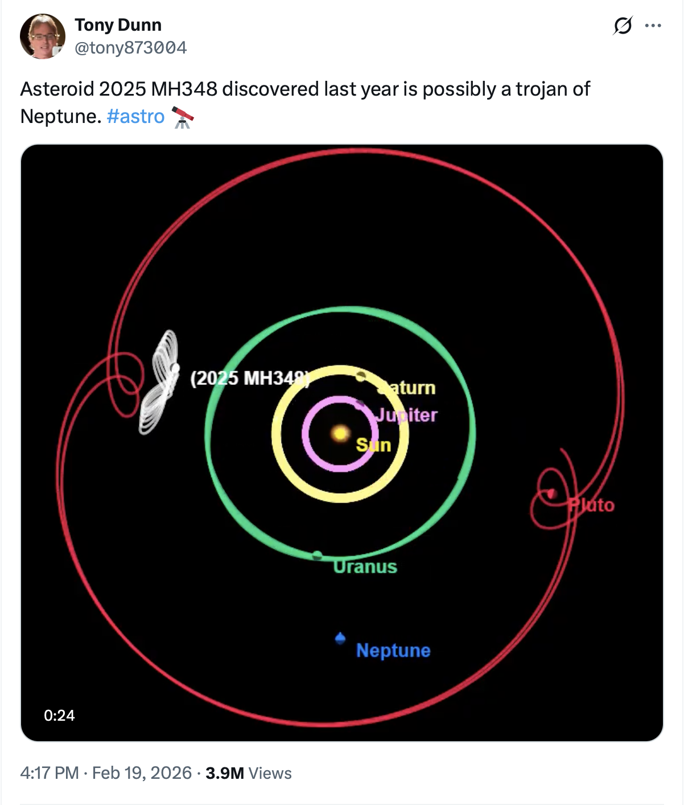

# Neptune-Pluto

I created this simulation using spacekit.js and three.js to visualize Pluto's orbit from Neptune's perspective, mainly to understand what's going on here:

https://x.com/tony873004/status/2024435586409648299

